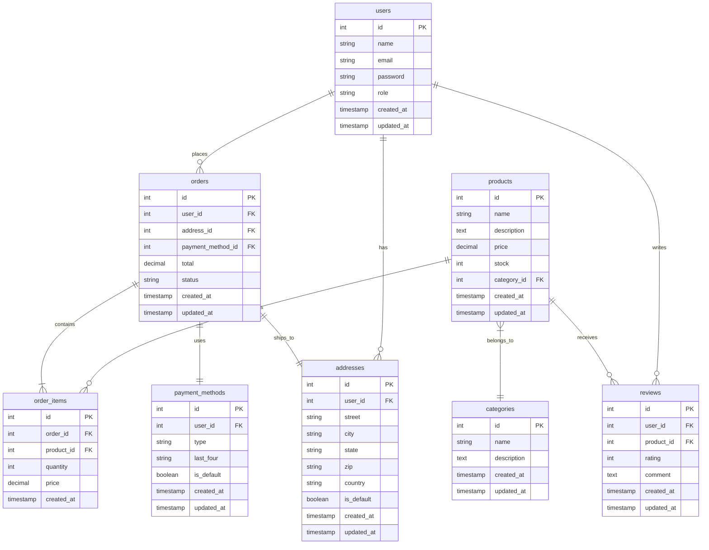

# Database Design Documentation

## Entity Relationship Diagram

## Table Descriptions

### Users
Stores user account information and authentication details.

| Column | Type | Description |
|--------|------|-------------|
| id | SERIAL | Primary key |
| name | VARCHAR(255) | User's full name |
| email | VARCHAR(255) | Unique email address |
| password | VARCHAR(255) | Hashed password |
| role | VARCHAR(50) | User role (customer/admin) |
| created_at | TIMESTAMP | Account creation date |
| updated_at | TIMESTAMP | Last update date |

### Products
Contains product information and inventory details.

| Column | Type | Description |
|--------|------|-------------|
| id | SERIAL | Primary key |
| name | VARCHAR(255) | Product name |
| description | TEXT | Product description |
| price | DECIMAL(10,2) | Product price |
| stock | INTEGER | Available quantity |
| category_id | INTEGER | Foreign key to categories |
| created_at | TIMESTAMP | Creation date |
| updated_at | TIMESTAMP | Last update date |

### Categories
Product categorization and organization.

| Column | Type | Description |
|--------|------|-------------|
| id | SERIAL | Primary key |
| name | VARCHAR(255) | Category name |
| description | TEXT | Category description |
| created_at | TIMESTAMP | Creation date |
| updated_at | TIMESTAMP | Last update date |

### Orders
Stores order information and status.

| Column | Type | Description |
|--------|------|-------------|
| id | SERIAL | Primary key |
| user_id | INTEGER | Foreign key to users |
| address_id | INTEGER | Foreign key to addresses |
| payment_method_id | INTEGER | Foreign key to payment_methods |
| total | DECIMAL(10,2) | Order total |
| status | VARCHAR(50) | Order status |
| created_at | TIMESTAMP | Order date |
| updated_at | TIMESTAMP | Last update date |

### Order Items
Individual items within an order.

| Column | Type | Description |
|--------|------|-------------|
| id | SERIAL | Primary key |
| order_id | INTEGER | Foreign key to orders |
| product_id | INTEGER | Foreign key to products |
| quantity | INTEGER | Item quantity |
| price | DECIMAL(10,2) | Price at time of order |
| created_at | TIMESTAMP | Creation date |

### Addresses
User shipping and billing addresses.

| Column | Type | Description |
|--------|------|-------------|
| id | SERIAL | Primary key |
| user_id | INTEGER | Foreign key to users |
| street | VARCHAR(255) | Street address |
| city | VARCHAR(100) | City |
| state | VARCHAR(50) | State/province |
| zip | VARCHAR(20) | Postal code |
| country | VARCHAR(100) | Country |
| is_default | BOOLEAN | Default address flag |
| created_at | TIMESTAMP | Creation date |
| updated_at | TIMESTAMP | Last update date |

### Reviews
Product reviews and ratings.

| Column | Type | Description |
|--------|------|-------------|
| id | SERIAL | Primary key |
| user_id | INTEGER | Foreign key to users |
| product_id | INTEGER | Foreign key to products |
| rating | INTEGER | Rating (1-5) |
| comment | TEXT | Review text |
| created_at | TIMESTAMP | Creation date |
| updated_at | TIMESTAMP | Last update date |

### Payment Methods
User payment information.

| Column | Type | Description |
|--------|------|-------------|
| id | SERIAL | Primary key |
| user_id | INTEGER | Foreign key to users |
| type | VARCHAR(50) | Payment type |
| last_four | VARCHAR(4) | Last 4 digits |
| is_default | BOOLEAN | Default payment flag |
| created_at | TIMESTAMP | Creation date |
| updated_at | TIMESTAMP | Last update date |

## Indexes

### Primary Indexes
- users(id)
- products(id)
- categories(id)
- orders(id)
- order_items(id)
- addresses(id)
- reviews(id)
- payment_methods(id)

### Foreign Key Indexes
- products(category_id)
- orders(user_id)
- orders(address_id)
- orders(payment_method_id)
- order_items(order_id)
- order_items(product_id)
- addresses(user_id)
- reviews(user_id)
- reviews(product_id)
- payment_methods(user_id)

### Performance Indexes
- users(email)
- products(name)
- products(price)
- orders(status)
- orders(created_at)
- reviews(rating)

## Relationships

### One-to-Many
- User to Orders
- User to Addresses
- User to Reviews
- User to Payment Methods
- Product to Order Items
- Product to Reviews
- Category to Products
- Order to Order Items

### Many-to-One
- Order Items to Products
- Order Items to Orders
- Reviews to Products
- Reviews to Users
- Addresses to Users
- Payment Methods to Users

## Constraints

### Unique Constraints
- users(email)
- products(name)
- categories(name)

### Check Constraints
- products(price > 0)
- products(stock >= 0)
- reviews(rating >= 1 AND rating <= 5)
- orders(total >= 0)

### Foreign Key Constraints
- products.category_id REFERENCES categories(id)
- orders.user_id REFERENCES users(id)
- orders.address_id REFERENCES addresses(id)
- orders.payment_method_id REFERENCES payment_methods(id)
- order_items.order_id REFERENCES orders(id)
- order_items.product_id REFERENCES products(id)
- addresses.user_id REFERENCES users(id)
- reviews.user_id REFERENCES users(id)
- reviews.product_id REFERENCES products(id)
- payment_methods.user_id REFERENCES users(id)

## Optimization Notes

### Query Optimization
- Use appropriate indexes for frequent queries
- Implement pagination for large result sets
- Cache frequently accessed data
- Use materialized views for complex reports

### Data Maintenance
- Regular VACUUM operations
- Index maintenance
- Statistics updates
- Backup scheduling

### Performance Monitoring
- Query execution plans
- Index usage statistics
- Table size monitoring
- Connection pool metrics 