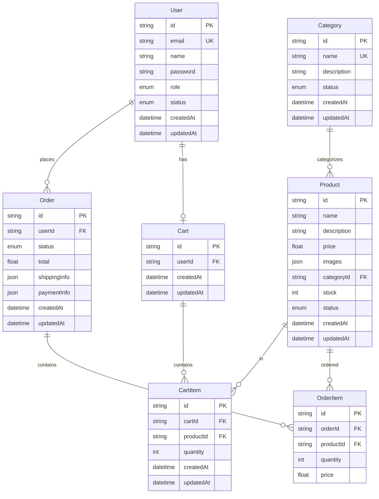

# Database Documentation

## Entity Relationship Diagram



## Database Schema

### User Table
```sql
CREATE TABLE User (
    id VARCHAR(255) PRIMARY KEY,
    email VARCHAR(255) UNIQUE NOT NULL,
    name VARCHAR(255) NOT NULL,
    password VARCHAR(255) NOT NULL,
    role ENUM('ADMIN', 'CUSTOMER') DEFAULT 'CUSTOMER',
    status ENUM('ACTIVE', 'INACTIVE') DEFAULT 'ACTIVE',
    createdAt DATETIME DEFAULT CURRENT_TIMESTAMP,
    updatedAt DATETIME DEFAULT CURRENT_TIMESTAMP ON UPDATE CURRENT_TIMESTAMP
);
```

### Product Table
```sql
CREATE TABLE Product (
    id VARCHAR(255) PRIMARY KEY,
    name VARCHAR(255) NOT NULL,
    description TEXT NOT NULL,
    price DECIMAL(10,2) NOT NULL,
    images JSON NOT NULL,
    categoryId VARCHAR(255) NOT NULL,
    stock INT NOT NULL DEFAULT 0,
    status ENUM('ACTIVE', 'INACTIVE') DEFAULT 'ACTIVE',
    createdAt DATETIME DEFAULT CURRENT_TIMESTAMP,
    updatedAt DATETIME DEFAULT CURRENT_TIMESTAMP ON UPDATE CURRENT_TIMESTAMP,
    FOREIGN KEY (categoryId) REFERENCES Category(id)
);
```

### Category Table
```sql
CREATE TABLE Category (
    id VARCHAR(255) PRIMARY KEY,
    name VARCHAR(255) UNIQUE NOT NULL,
    description TEXT NOT NULL,
    status ENUM('ACTIVE', 'INACTIVE') DEFAULT 'ACTIVE',
    createdAt DATETIME DEFAULT CURRENT_TIMESTAMP,
    updatedAt DATETIME DEFAULT CURRENT_TIMESTAMP ON UPDATE CURRENT_TIMESTAMP
);
```

### Order Table
```sql
CREATE TABLE Order (
    id VARCHAR(255) PRIMARY KEY,
    userId VARCHAR(255) NOT NULL,
    status ENUM('PENDING', 'PROCESSING', 'SHIPPED', 'DELIVERED', 'CANCELLED') DEFAULT 'PENDING',
    total DECIMAL(10,2) NOT NULL,
    shippingInfo JSON NOT NULL,
    paymentInfo JSON NOT NULL,
    createdAt DATETIME DEFAULT CURRENT_TIMESTAMP,
    updatedAt DATETIME DEFAULT CURRENT_TIMESTAMP ON UPDATE CURRENT_TIMESTAMP,
    FOREIGN KEY (userId) REFERENCES User(id)
);
```

### OrderItem Table
```sql
CREATE TABLE OrderItem (
    id VARCHAR(255) PRIMARY KEY,
    orderId VARCHAR(255) NOT NULL,
    productId VARCHAR(255) NOT NULL,
    quantity INT NOT NULL,
    price DECIMAL(10,2) NOT NULL,
    FOREIGN KEY (orderId) REFERENCES Order(id),
    FOREIGN KEY (productId) REFERENCES Product(id)
);
```

### Cart Table
```sql
CREATE TABLE Cart (
    id VARCHAR(255) PRIMARY KEY,
    userId VARCHAR(255) UNIQUE,
    createdAt DATETIME DEFAULT CURRENT_TIMESTAMP,
    updatedAt DATETIME DEFAULT CURRENT_TIMESTAMP ON UPDATE CURRENT_TIMESTAMP,
    FOREIGN KEY (userId) REFERENCES User(id)
);
```

### CartItem Table
```sql
CREATE TABLE CartItem (
    id VARCHAR(255) PRIMARY KEY,
    cartId VARCHAR(255) NOT NULL,
    productId VARCHAR(255) NOT NULL,
    quantity INT NOT NULL,
    createdAt DATETIME DEFAULT CURRENT_TIMESTAMP,
    updatedAt DATETIME DEFAULT CURRENT_TIMESTAMP ON UPDATE CURRENT_TIMESTAMP,
    FOREIGN KEY (cartId) REFERENCES Cart(id),
    FOREIGN KEY (productId) REFERENCES Product(id)
);
```

## Indexes

### User Table
- Primary Key: `id`
- Unique Index: `email`

### Product Table
- Primary Key: `id`
- Foreign Key: `categoryId`
- Index: `name` (for search optimization)

### Category Table
- Primary Key: `id`
- Unique Index: `name`

### Order Table
- Primary Key: `id`
- Foreign Key: `userId`
- Index: `status` (for filtering)
- Index: `createdAt` (for sorting)

### OrderItem Table
- Primary Key: `id`
- Foreign Keys: `orderId`, `productId`

### Cart Table
- Primary Key: `id`
- Foreign Key: `userId`
- Unique Index: `userId`

### CartItem Table
- Primary Key: `id`
- Foreign Keys: `cartId`, `productId`

## Relationships

1. User to Order (One-to-Many)
   - A user can have multiple orders
   - Each order belongs to one user

2. User to Cart (One-to-One)
   - A user can have one cart
   - Each cart belongs to one user

3. Cart to CartItem (One-to-Many)
   - A cart can have multiple items
   - Each cart item belongs to one cart

4. Product to CartItem (One-to-Many)
   - A product can be in multiple cart items
   - Each cart item references one product

5. Product to OrderItem (One-to-Many)
   - A product can be in multiple order items
   - Each order item references one product

6. Order to OrderItem (One-to-Many)
   - An order can have multiple items
   - Each order item belongs to one order

7. Category to Product (One-to-Many)
   - A category can have multiple products
   - Each product belongs to one category

## Data Types

- `VARCHAR(255)`: For IDs, names, and other short text
- `TEXT`: For long text like descriptions
- `DECIMAL(10,2)`: For prices (10 digits total, 2 decimal places)
- `INT`: For quantities and stock
- `JSON`: For complex data like images and addresses
- `DATETIME`: For timestamps
- `ENUM`: For status and role fields

## Constraints

1. Primary Keys
   - All tables have a unique `id` field
   - IDs are generated using CUID

2. Foreign Keys
   - All relationships are enforced with foreign key constraints
   - Cascade delete is not enabled for data integrity

3. Unique Constraints
   - User email must be unique
   - Category name must be unique
   - User can have only one cart

4. Not Null Constraints
   - Essential fields are marked as NOT NULL
   - Optional fields can be NULL

## Optimizations

1. Indexing Strategy
   - Primary keys are indexed by default
   - Foreign keys are indexed for join performance
   - Frequently searched fields are indexed

2. Data Types
   - Appropriate data types for each field
   - JSON for flexible data structures
   - ENUM for constrained choices

3. Timestamps
   - Automatic timestamp management
   - UpdatedAt triggers for tracking changes 