# User Flow Documentation

## Public User Flows

### 1. Browsing Products
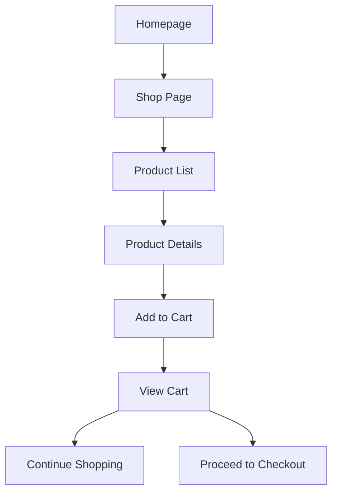

### 2. User Registration
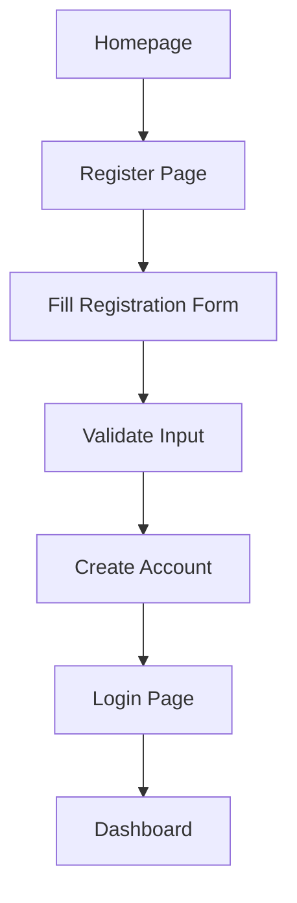

### 3. User Login
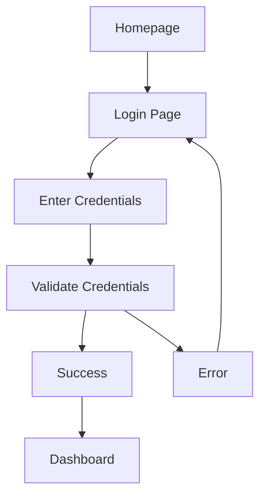

## Shopping Flow

### 1. Cart Management
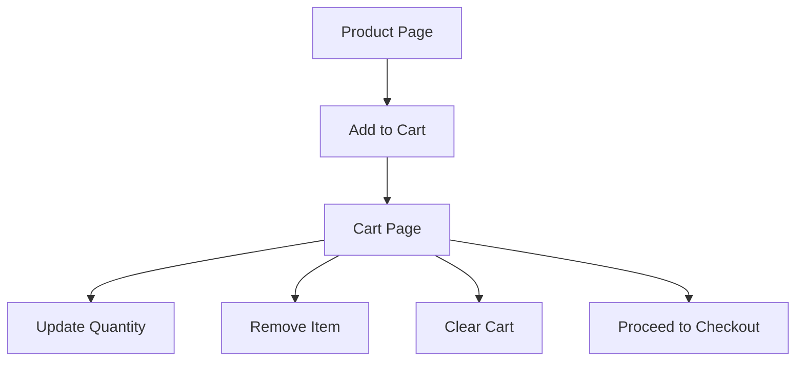

### 2. Checkout Process
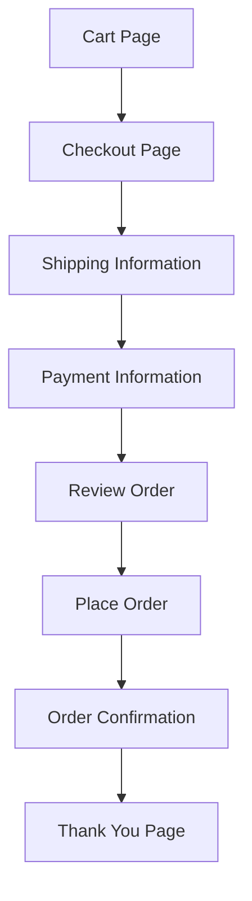

## User Account Management

### 1. Profile Management
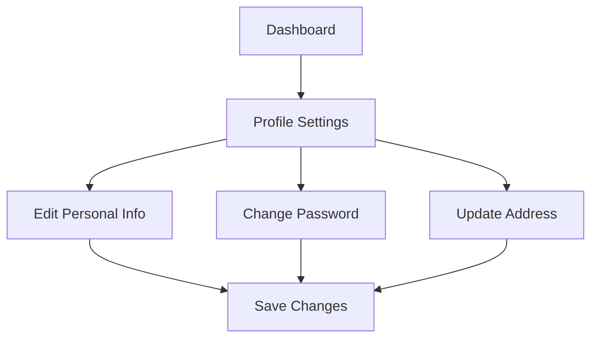

### 2. Order Management
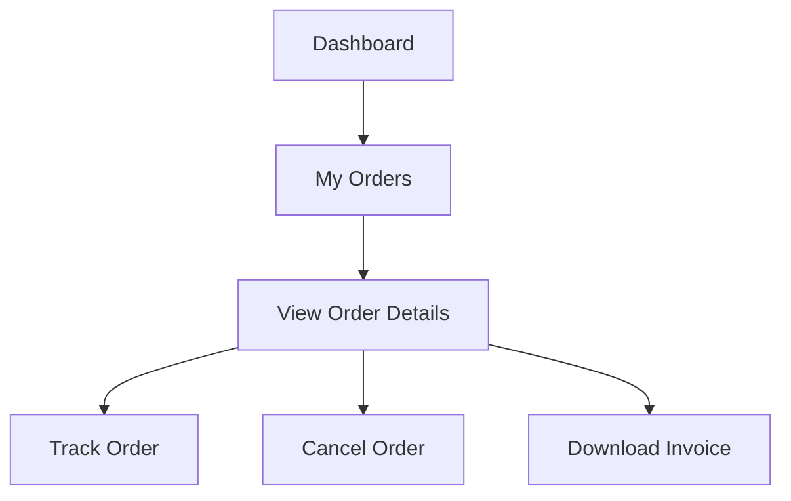

## Admin Flows

### 1. Product Management
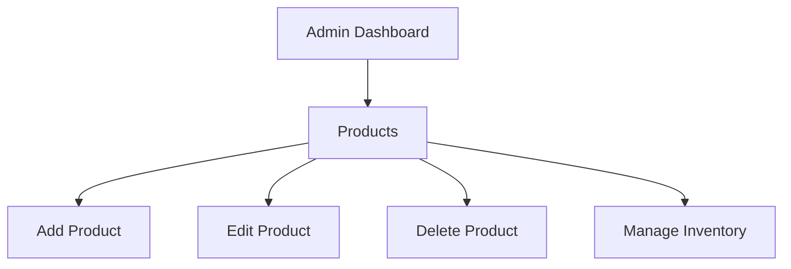

### 2. Order Management
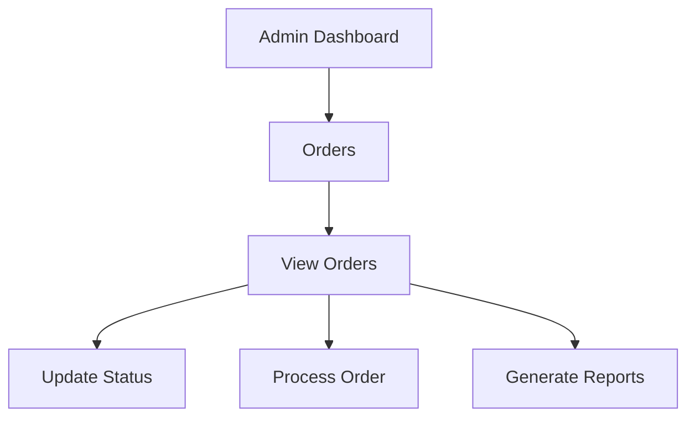

## Data Validation Rules

### User Registration
- Email: Valid email format
- Password: Minimum 8 characters, 1 uppercase, 1 number
- Name: Required, minimum 2 characters
- Phone: Optional, valid format if provided

### Product Information
- Name: Required, minimum 3 characters
- Price: Required, positive number
- Stock: Required, non-negative integer
- Description: Required, minimum 10 characters
- Images: At least one image required

### Order Information
- Shipping Address: All fields required
- Payment Information: Valid card details
- Quantity: Positive integer, not exceeding stock

## Error Handling

### Form Validation
- Real-time validation feedback
- Clear error messages
- Field-specific error indicators

### Payment Processing
- Card validation
- Transaction error handling
- Payment confirmation

### Order Processing
- Stock validation
- Price verification
- Order status updates

## Success Messages

### User Actions
- Registration successful
- Login successful
- Profile updated
- Password changed

### Shopping Actions
- Added to cart
- Order placed
- Payment successful
- Order status updated

## Security Measures

### Authentication
- Session management
- Password hashing
- JWT token validation

### Authorization
- Role-based access control
- Protected routes
- API endpoint security

## User Journey Diagrams

### Customer Journey
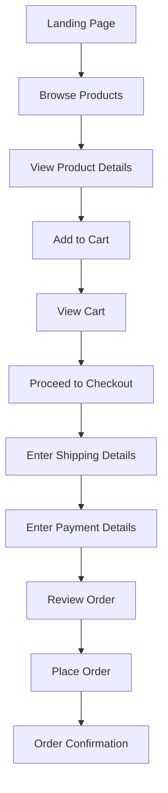

### Authentication Flow
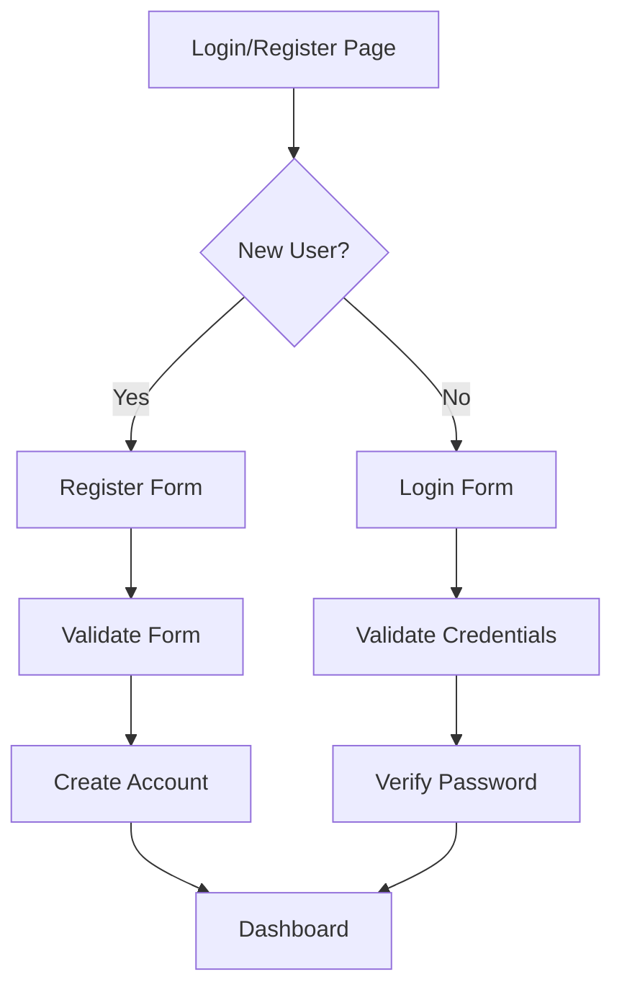

### Order Management Flow
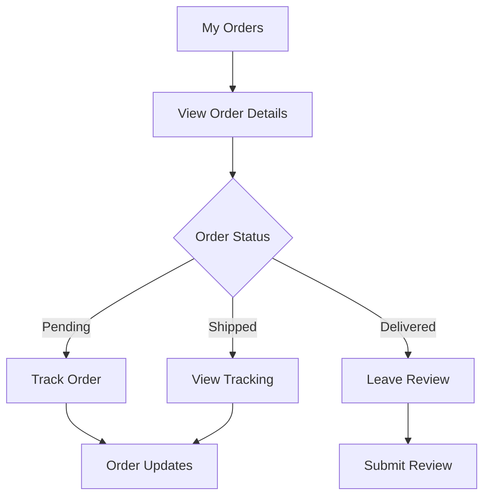

## Form Validation Rules

### Registration Form
- Name: 2-50 characters, letters and spaces only
- Email: Valid email format, unique in database
- Password: Minimum 8 characters, 1 uppercase, 1 number
- Confirm Password: Must match password

### Checkout Form
- Shipping Address:
  - Street: Required, 5-100 characters
  - City: Required, 2-50 characters
  - State: Required, valid state code
  - ZIP: Required, valid ZIP format
- Payment Details:
  - Card Number: 16 digits, valid Luhn algorithm
  - Expiry: Valid future date
  - CVV: 3-4 digits
  - Name on Card: Required, 2-50 characters

## Error Messages

### Authentication Errors
- Invalid email format
- Password too weak
- Email already registered
- Invalid credentials
- Account locked

### Checkout Errors
- Invalid shipping address
- Payment declined
- Insufficient stock
- Invalid coupon code
- Session expired

## Success Messages

### Order Status
- Order placed successfully
- Payment processed
- Order shipped
- Order delivered
- Review submitted

### Account Actions
- Account created
- Password updated
- Profile updated
- Address added
- Payment method added

## Data Flow Diagrams

### Product Search Flow
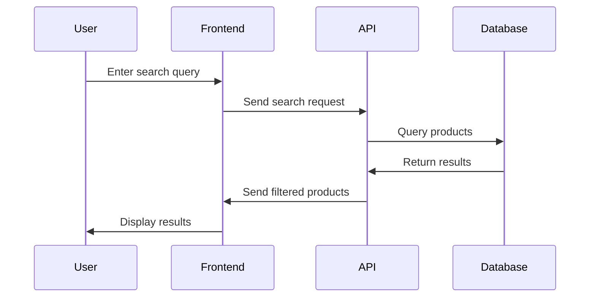

### Checkout Flow
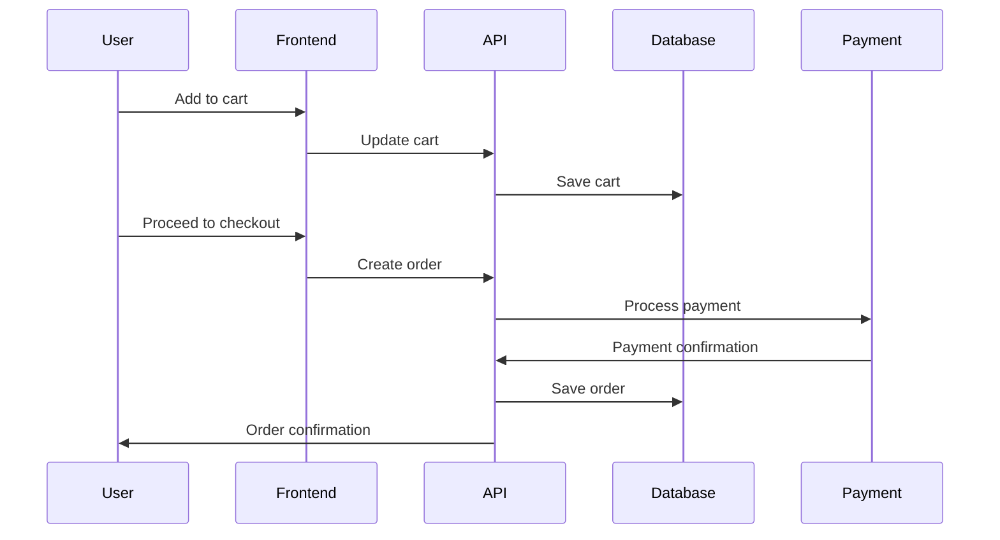

## User Interface States

### Product List
- Loading state
- Empty state
- Error state
- Filtered results
- Pagination

### Cart
- Empty cart
- Items in cart
- Updating quantity
- Removing item
- Applying coupon

### Checkout
- Shipping form
- Payment form
- Order review
- Processing payment
- Order confirmation

## Accessibility Considerations

### Navigation
- Keyboard navigation
- Screen reader support
- Focus management
- Skip links
- ARIA labels

### Forms
- Error announcements
- Field descriptions
- Required field indicators
- Validation feedback
- Submit button states

## Mobile Responsiveness

### Breakpoints
- Mobile: < 640px
- Tablet: 640px - 1024px
- Desktop: > 1024px

### Layout Adjustments
- Stacked navigation
- Collapsible sections
- Touch-friendly buttons
- Responsive images
- Flexible grids

## Performance Metrics

### Loading Times
- First contentful paint: < 1.5s
- Time to interactive: < 3.5s
- Largest contentful paint: < 2.5s

### User Interactions
- Click response: < 100ms
- Form submission: < 1s
- Page transitions: < 300ms
- Image loading: < 2s

## Analytics Events

### User Actions
- Page views
- Product views
- Add to cart
- Remove from cart
- Checkout steps
- Order completion

### Error Tracking
- Form validation errors
- API errors
- Payment failures
- Navigation errors
- Resource loading errors 